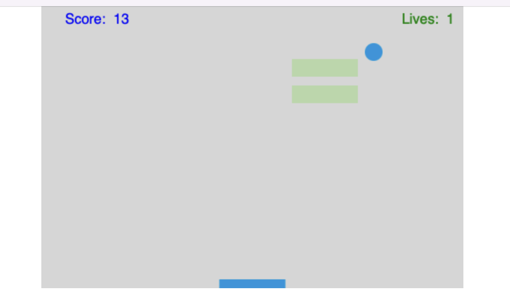

# Breakout Game
from Breakout tutorial for ACS 1320

# Work Process Documentation

## What is your project?
My project is a remake of Breakout, the bricks and paddle game, based on a tutorial

## Why you made it
I made it as part of ACS 1320

## screen shot from the game

## Getting started - how to run the project
To run the project, open index.html with live server

## Tools and technologies used
HTML, JS, ESLint, Node, npm, yarn, TypeScript

linting, classes, bundling